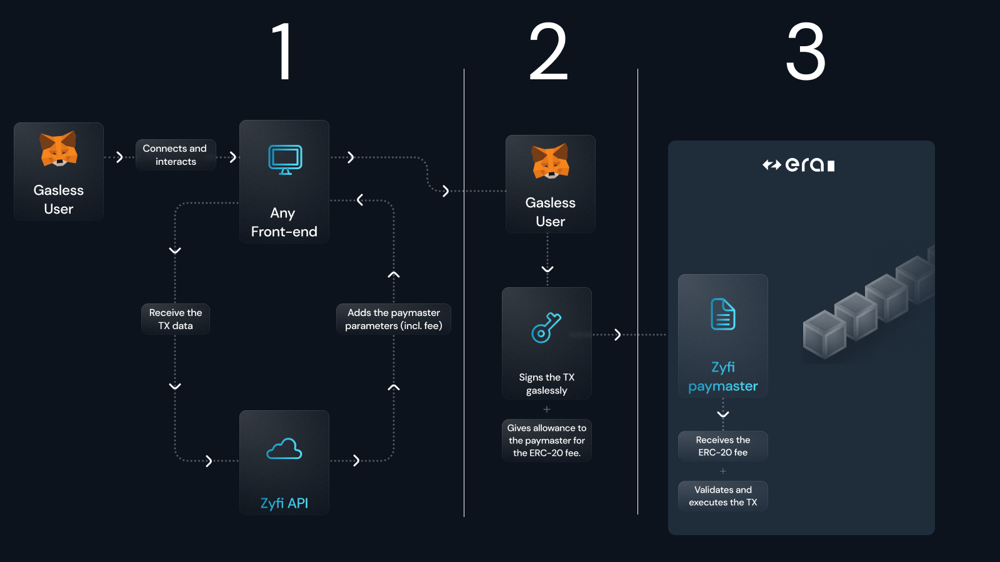

# How Zyfi works ?

## HOW DOES Zyfi WORKS?

Zyfi offers gasless transactions using a Paymaster-as-a- Service integrated with zkSync's native Account Abstraction (AA) technology. This allows any externally owned account (EOA) to execute transactions without needing ETH for gas. The process involves three mayor steps:

1. **The paymaster API interacts directly with any front end.** It receives the transaction data and adds the paymaster parameters including the fee taken on the ERC-20 that will be used to pay for the gas costs.
2. **User signing transaction data.** The user then signs a gasless transaction and gives the allowance to the paymaster for the ERC-20 fee.
3. **Paymaster execution.** The Zyfi Paymaster then receives the ERC-20 fee to validate and execute the transaction while paying the ETH gas fees for the end user.

## Paymaster Flow

The flow of the paymaster enables a smooth process for users to be able to swap without the need for gas. The following process is completely trustless and can enable a user to pay with any ERC-20 token. Let's break down in detail the whole process into 3 steps.

* Fetching the **transaction data from the front end**
* User signing the reconstructed transaction
* Transaction Execution

<figure><figcaption>
Full Paymaster Flow
</figcaption></figure>

>
